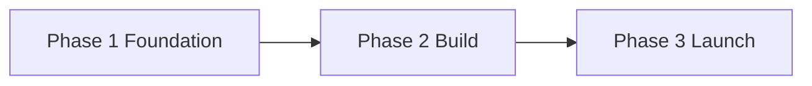

# Website execution — three-phase plan

This document turns the high-level vision in `WEBSITE_PLAN.md` into an **ordered execution path**. Adjust dates with your advisor and officer calendar; phases can overlap slightly where noted.

---

## Phase 1 — Foundation and alignment

**Goal:** Everything needed to build *without* rework: decisions, permissions, raw content, and platform choice.

### 1.1 Stakeholder and policy

- Confirm with the **club advisor**: public contact method, what can be said about launches/venues, photo policy for students, and any **required disclaimers** (assumption of risk, “views are students’,” etc.).
- Confirm with **ICC** (or equivalent): **directory category**, one-paragraph **blurb**, and when your URL can be listed on the All Clubs page.
- If you will use **Ardrey Kell logos or mascots**, confirm **school branding rules** in writing (many schools restrict official marks on club sites).

### 1.2 Platform and ownership

- Choose hosting approach (e.g. Weebly, GitHub Pages, Google Sites—see `WEBSITE_PLAN.md` §8).
- Register or designate: **canonical URL**, **club email** or alias, and **who holds passwords** (president + advisor backup).
- Create a **simple continuity note** for the next officers: where the site lives, renewal dates, form owners.

### 1.3 Content inventory (draft in Google Doc or similar)

Produce **draft text** (can be rough) for:

- **Home:** headline, mission, three pillars (ARC / CHMS / launches), primary CTAs.
- **Join:** steps to join, dues if any, meeting cadence placeholder.
- **ARC:** two-team description, season timeline placeholders, link to official competition site.
- **CHMS outreach:** program summary, “schedule TBD” if needed, interest funnel copy.
- **Launches & safety:** public-safe checklist summary; motor classes you actually use (after advisor input).
- **About:** officer roles and names; constitution status (PDF later); advisor block.
- **Contact:** approved emails/social handles only.

**Exit criterion:** Advisor has reviewed drafts for accuracy and safety; no blocked unknowns except dates you’ll fill in Phase 2.

### 1.4 Visual assets (parallel with images you’ll add later)

- List **required images** (see `images/IMAGE_CHECKLIST.txt`); note which can ship as **placeholders** until your photos arrive.
- Decide **color accent** (one non-purple accent for rockets/flames) and **two fonts** max if the platform allows.

**Exit criterion:** Platform account ready; drafts exist; checklist of pages matches `WEBSITE_PLAN.md` sitemap; no trademark surprises.

---

## Phase 2 — Build, integrate, and polish

**Goal:** A complete private preview that matches your structure, with working joins and calendar.

### 2.1 Site structure

- Implement **navigation** to match the agreed sitemap (Home, Join & Calendar, ARC, CHMS, Launches & Safety, Resources, About, Gallery optional, Sponsors optional, Contact).
- Apply **consistent header/footer** (club name, socials, last-updated note optional).

### 2.2 Page build

- Lay out each page with **real copy** from Phase 1; replace placeholders with bullets where data is still TBD.
- Add **ARC** and **resources** external links; test they open in a new tab if your platform supports it.
- **Gallery/Media:** add sections only when you have **rights and consent** for each image; use alt text on every meaningful image.

### 2.3 Forms and calendar

- Publish **Join/interest** form (fields: name, grade, email, experience level, parent contact if required by policy).
- If applicable, separate **CHMS interest** form with guardian fields.
- Connect **Google Calendar** (or equivalent): embed or link; ensure school account sharing rules are correct.

### 2.4 Quality pass

- **Mobile:** read every page on a phone; fix overflow and tap targets.
- **Accessibility:** heading order, contrast on purple overlays, form labels, image alt text.
- **Broken links:** sweep internal and external URLs.
- **Privacy:** remove personal phones, home addresses, and precise field locations unless cleared.

**Exit criterion:** Full site walkthrough with advisor; ICC blurb + URL finalized; you’d be comfortable if a parent opened any page.

**Implemented in repo:** Home page **`#join`** points members to **Band** for day-to-day comms; `outreach.html` may embed a **CHMS** Google Form via `js/config.js` (`chmsFormEmbedUrl`). Empty CHMS slot shows setup hints until configured.

---

## Phase 3 — Launch, listing, and living maintenance

**Goal:** Go public, get discovered, and keep the site trustworthy all season.

### 3.1 Soft launch

- Share the URL with **small group** (officers + advisor); fix feedback in 24–72 hours.
- Post **one** coordinated teaser on approved **social** (if you use it).

### 3.2 Public launch

- Submit **directory** update to ICC with final **one-paragraph description** and link.
- Announce via **email** or **school-approved** channels if allowed.
- Optional: **short “about” video** link for ICC table (only if quality bar is met).

### 3.3 Post-launch rhythm (ongoing)

| Cadence | Task |
| ------- | ---- |
| After each major event | 3–5 photos + short recap on Home or Flight Log |
| Monthly | Quick link check; update calendar |
| Each officer transition | Password handoff, new roster on About |
| End of school year | Archive snapshots; export form responses per policy |

**Exit criterion:** Live URL stable; ICC listing live; maintenance owner named for the next semester.

**Implemented in repo:**

- **`404.html`** — Branded “page not found” with `noindex` (works on GitHub Pages when served as the custom 404).
- **`robots.txt`** — Allows crawlers; comments show how to add an absolute `Sitemap:` URL after deploy.
- **`sitemap.xml`** — All main pages; replace `__AK_ROCKETRY_SITE_URL__` with your HTTPS origin (see `js/config.js` header).
- **`index.html`** — `link[rel=canonical]`, Open Graph, and Twitter card tags using the same placeholder origin; **og:image** points at `images/hero-launch.jpg` once that file exists and the URL is fixed.
- **Footers** — Public-facing disclaimer (student-maintained; not an official Charlotte-Mecklenburg Schools publication). Join & Outreach keep a one-line pointer to `js/config.js` for embeds.
- **`about.html`** — Phase 3 ICC + launch checklist (soft launch, directory, SEO replace, announce, recaps).

---

## Phase dependency overview

**Overlap allowed:** Collecting images and drafting copy in Phase 1 while setting up the empty site in early Phase 2 is fine, as long as advisor review (end of Phase 1) finishes before you call Phase 2 “done.”

---

## Quick reference

| Phase | Primary output |
| ----- | --------------- |
| **1** | Approved copy, platform live, policy OK, asset list |
| **2** | Full private site, forms, calendar, QA |
| **3** | Public launch, ICC link, maintenance rhythm |

For **page-level detail and creative ideas**, keep using `WEBSITE_PLAN.md`. Update *this* file when your real calendar dates land (ARC deadlines, CHMS first session, first launch).
